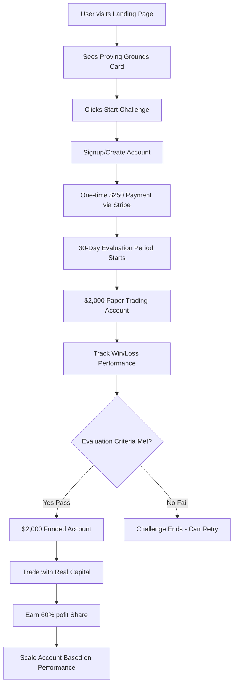

# GammaBox Proving Grounds - $2K Challenge

## Overview

Add a prop trading evaluation service following Blueberry Funded's business model. Traders pay $250 for a one-month paper trading challenge with a $2,000 virtual account. After passing the evaluation (meeting win/loss criteria), successful traders receive a $2,000 funded account with profit sharing (70-90% to trader) and the ability to scale their account based on consistent performance.

## Blueberry Model Alignment

Following Blueberry Funded's structure:

- **Evaluation Fee**: $250 one-time payment
- **Challenge Account**: $2,000 virtual account (paper trading)
- **Evaluation Period**: 30 days
- **Profit Target**: 6-8% (typical Blueberry range for this size)
- **Max Drawdown**: 3-5% (typical Blueberry range)
- **Profit Split**: 70-80% to trader (scales with account growth)
- **Account Growth**: Traders can scale from $2k to $200k+ based on performance
- **Payout Schedule**: Monthly payouts (first week of subsequent month)

## Architecture




## Frontend Changes

### 1. Update PricingSection Component

**File:** `apps/landing/src/components/PricingSection.tsx`

- Display two pricing cards side-by-side:
- Left: Existing Elite tier ($3,000/mo)
- Right: New Proving Grounds tier ($250 one-time)
- Add Proving Grounds card configuration:
- Price: $250 (one-time payment, not monthly)
- Tagline: "Pass the Challenge. Get Funded. Scale Your Account."
- Features:
    - $2,000 paper trading account
    - 30-day evaluation period
    - 70-80% profit split after passing
    - Account scaling from $2k to $200k+
    - No monthly fees on funded accounts
    - Monthly profit payouts

### 2. Update PricingCard Component

**File:** `apps/landing/src/components/PricingCard.tsx`

- Add support for one-time payments:
- New prop: `isOneTime?: boolean`
- Display "/one-time" instead of "/mo" when `isOneTime={true}`
- Update styling to differentiate one-time vs subscription
- Update button behavior:
- Proving Grounds: "Start Challenge" → routes to `/proving-grounds/signup`
- Elite: Existing behavior (redirects to elite landing)

### 3. Add Proving Grounds Content

**Files:** `apps/landing/src/components/PricingSection.tsx`, `apps/landing/src/components/FAQSection.tsx`**Pricing Section Content:**

- Clear explanation: "Pay $250 to paper trade for 30 days. Pass the evaluation and get a $2,000 funded account. Earn 70-80% of profits and scale your account up to $200k+."
- Highlight: "No recurring fees on funded accounts - only pay the challenge fee once"

**FAQ Entries:**

- "How does the evaluation work?"
- Answer: 30-day paper trading challenge with $2,000 virtual account. Must meet profit target (6-8%) while staying within drawdown limits (3-5%). Pass to get funded.
- "What happens after I pass?"
- Answer: You receive a $2,000 funded trading account. Trade with real capital, keep 70-80% of profits. Scale your account based on consistent performance.
- "Can I scale my account?"
- Answer: Yes! Consistent profitable traders can scale from $2k to $200k+ based on performance metrics. Larger accounts earn higher profit splits (up to 90%).
- "How do payouts work?"
- Answer: Monthly payouts processed in the first week of each month. Profit split is calculated on realized gains.

## Backend Changes

### 4. Database Schema Updates

**File:** `apps/webapp_backend/app/models/subscription.py`

- Add `'proving_grounds'` to `subscription_tier_enum`:
```python
subscription_tier_enum = ENUM('free', 'starter', 'pro', 'day_trader', 'elite', 'proving_grounds', name='subscription_tier')
```


**File:** `apps/webapp_backend/app/models/usage.py`

- Add `'proving_grounds'` to `subscription_tier_enum` in usage models

### 5. Create Prop Evaluation Model

**New File:** `apps/webapp_backend/app/models/prop_evaluation.py`

```python
class PropEvaluation(Base):
    __tablename__ = "prop_evaluations"
    
    id = Column(UUID(as_uuid=True), primary_key=True, default=uuid.uuid4)
    user_id = Column(UUID(as_uuid=True), ForeignKey("users.id", ondelete="CASCADE"), nullable=False, index=True)
    
    # Challenge Phase
    challenge_account_size = Column(Numeric(10, 2), nullable=False, default=2000.00)  # $2,000
    challenge_fee_paid = Column(Numeric(10, 2), nullable=False, default=250.00)  # $250
    start_date = Column(DateTime(timezone=True), nullable=False)
    end_date = Column(DateTime(timezone=True), nullable=False)
    
    # Evaluation Criteria (Blueberry-style)
    profit_target_percent = Column(Numeric(5, 2), nullable=False, default=6.00)  # 6% target
    max_drawdown_percent = Column(Numeric(5, 2), nullable=False, default=4.00)  # 4% max drawdown
    max_daily_loss_percent = Column(Numeric(5, 2), nullable=False, default=5.00)  # 5% daily loss limit
    
    # Performance Metrics
    current_balance = Column(Numeric(10, 2), nullable=False, default=2000.00)
    peak_balance = Column(Numeric(10, 2), nullable=False, default=2000.00)
    total_profit_loss = Column(Numeric(10, 2), nullable=False, default=0.00)
    total_trades = Column(Integer, nullable=False, default=0)
    winning_trades = Column(Integer, nullable=False, default=0)
    losing_trades = Column(Integer, nullable=False, default=0)
    win_rate = Column(Numeric(5, 2), nullable=False, default=0.00)  # Percentage
    
    # Status Tracking
    status = Column(String, nullable=False, default='pending_payment')  # pending_payment, active, passed, failed, expired
    passed_at = Column(DateTime(timezone=True))
    failed_at = Column(DateTime(timezone=True))
    failure_reason = Column(String)  # exceeded_drawdown, exceeded_daily_loss, time_expired, etc.
    
    # Funded Account (if passed)
    funded_account_id = Column(UUID(as_uuid=True), ForeignKey("prop_funded_accounts.id"))
    funded_account_size = Column(Numeric(10, 2))  # $2,000 initial, can grow
    profit_split_percent = Column(Numeric(5, 2), default=75.00)  # 75% to trader (25% to platform)
    
    created_at = Column(DateTime(timezone=True), server_default=func.now())
    updated_at = Column(DateTime(timezone=True), server_default=func.now(), onupdate=func.now())
    
    # Relationships
    user = relationship("User", backref="prop_evaluations")
    funded_account = relationship("PropFundedAccount", backref="evaluation")
```


### 6. Create Funded Account Model

**New File:** `apps/webapp_backend/app/models/prop_funded_account.py`

```python
class PropFundedAccount(Base):
    __tablename__ = "prop_funded_accounts"
    
    id = Column(UUID(as_uuid=True), primary_key=True, default=uuid.uuid4)
    user_id = Column(UUID(as_uuid=True), ForeignKey("users.id", ondelete="CASCADE"), nullable=False, index=True)
    evaluation_id = Column(UUID(as_uuid=True), ForeignKey("prop_evaluations.id"), nullable=False)
    
    # Account Details
    account_size = Column(Numeric(10, 2), nullable=False, default=2000.00)  # Starts at $2k, can grow
    current_balance = Column(Numeric(10, 2), nullable=False, default=2000.00)
    total_profit = Column(Numeric(10, 2), nullable=False, default=0.00)
    total_withdrawn = Column(Numeric(10, 2), nullable=False, default=0.00)
    
    # Profit Sharing
    profit_split_percent = Column(Numeric(5, 2), nullable=False, default=75.00)  # 75% trader, 25% platform
    pending_payout = Column(Numeric(10, 2), nullable=False, default=0.00)
    
    # Account Status
    status = Column(String, nullable=False, default='active')  # active, suspended, closed
    scaling_eligible = Column(Boolean, default=True)
    last_payout_date = Column(DateTime(timezone=True))
    
    # TastyTrade Integration
    tasty_account_id = Column(String)  # Linked TastyTrade account for real trading
    
    created_at = Column(DateTime(timezone=True), server_default=func.now())
    updated_at = Column(DateTime(timezone=True), server_default=func.now(), onupdate=func.now())
    
    # Relationships
    user = relationship("User", backref="prop_funded_accounts")
    evaluation = relationship("PropEvaluation", backref="funded_account")
```


### 7. Create UsageLimit Entry

**Migration or Admin Script**

- Insert `UsageLimit` record for `proving_grounds` tier:
- Paper trading access only
- Unlimited evaluations (but only one active at a time)
- Features: `{"paper_trading": true, "evaluation_tracking": true, "funded_account_access": false}`

### 8. Stripe Integration Updates

**File:** `apps/webapp_backend/app/services/stripe_service.py`**Add One-Time Payment Method:**

```python


@staticmethod
async def create_one_time_checkout_session(
    user: User,
    product_name: str,
    amount_cents: int,  # $250 = 25000 cents
    db: AsyncSession,
    additional_metadata: Optional[Dict[str, str]] = None,
    frontend_url: Optional[str] = None,
    success_url: Optional[str] = None,
    cancel_url: Optional[str] = None
) -> Dict[str, Any]:
    """Create a Stripe Checkout session for one-time payment"""
    # Similar to create_checkout_session but mode="payment" instead of "subscription"
    # Use Price.create with one_time billing
```

**Setup Proving Grounds Product:**

- Create Stripe product: "GammaBox Proving Grounds Evaluation"
- Create one-time price: $250.00
- Store price_id for checkout sessions

### 9. Create Evaluation Routes

**New File:** `apps/webapp_backend/app/routes/prop_evaluation.py`**Endpoints:**

- `POST /api/v1/prop/evaluation/signup` - Create evaluation record (status: pending_payment)
- `POST /api/v1/prop/evaluation/{evaluation_id}/payment` - Create Stripe checkout for $250
- `GET /api/v1/prop/evaluation/{evaluation_id}/status` - Get evaluation progress, metrics
- `GET /api/v1/prop/evaluation/my-evaluation` - Get user's current active evaluation
- `POST /api/v1/prop/evaluation/{evaluation_id}/complete` - Admin: Mark as passed/failed
- `GET /api/v1/prop/evaluation/{evaluation_id}/trades` - Get challenge trade history

**Webhook Handler:**

- Handle `checkout.session.completed` for one-time payments
- Activate evaluation (status: active, start_date: now, end_date: now + 30 days)
- Grant paper trading access

### 10. Create Funded Account Routes

**New File:** `apps/webapp_backend/app/routes/prop_funded_account.py`**Endpoints:**

- `GET /api/v1/prop/funded-accounts` - List user's funded accounts
- `GET /api/v1/prop/funded-accounts/{account_id}` - Get account details and performance
- `GET /api/v1/prop/funded-accounts/{account_id}/performance` - Get profit/loss metrics
- `POST /api/v1/prop/funded-accounts/{account_id}/request-payout` - Request profit payout
- `GET /api/v1/prop/funded-accounts/{account_id}/payouts` - Get payout history

### 11. Evaluation Logic Service

**New File:** `apps/webapp_backend/app/services/evaluation_service.py`**Key Methods:**

- `calculate_evaluation_progress(evaluation_id)` - Track win/loss, P&L, drawdown
- `check_evaluation_criteria(evaluation_id)` - Determine if passed/failed:
- ✅ Pass: Profit target reached (6-8%) AND within drawdown limits
- ❌ Fail: Exceeded max drawdown (4%) OR exceeded daily loss (5%) OR time expired
- `complete_evaluation(evaluation_id, status)` - Mark passed/failed, create funded account if passed
- `track_paper_trade(trade)` - Record paper trades and update evaluation metrics

### 12. Profit Calculation Service

**New File:** `apps/webapp_backend/app/services/profit_calculation_service.py`

- Calculate realized profits on funded accounts
- Apply profit split (75% trader, 25% platform)
- Track pending payouts
- Handle monthly payout processing
- Calculate account scaling eligibility based on consistent performance

## Evaluation Criteria (Blueberry-Style)

Following Blueberry Funded's typical parameters for $2k account:

- **Profit Target**: 6-8% of starting balance ($120-$160 profit)
- **Max Drawdown**: 4% of peak balance ($80 max loss from peak)
- **Daily Loss Limit**: 5% of starting balance ($100 max loss per day)
- **Time Limit**: 30 days
- **Minimum Trading Days**: At least 5 trading days required
- **Pass Condition**: Reach profit target while staying within all limits

## Payment Flow

1. User clicks "Start Challenge" on pricing card
2. Redirects to `/proving-grounds/signup`
3. User creates account or logs in
4. Backend creates `PropEvaluation` record with status `pending_payment`
5. Creates Stripe checkout session (one-time $250 payment)
6. User completes payment
7. Stripe webhook `checkout.session.completed` activates evaluation:

- Status → `active`
- `start_date` → now
- `end_date` → now + 30 days
- Grant paper trading access with $2,000 virtual account

8. User paper trades for 30 days
9. System tracks all trades, calculates metrics:

- Win rate, total P&L, current drawdown, daily loss

10. Evaluation auto-completes after 30 days OR if criteria met/failed
11. If passed:

    - Create `PropFundedAccount` with $2,000 initial balance
    - Grant access to real trading with capital
    - Set profit split to 75% (trader) / 25% (platform)

12. If failed:

    - Status → `failed`
    - User can purchase new challenge to retry

## Key Implementation Details

- **One-Time Payment**: Stripe checkout mode `payment` (not `subscription`)
- **Paper Trading**: Separate paper trading system integration (existing tasty-agent-paper infrastructure)
- **Real-Time Tracking**: Update evaluation metrics after each paper trade
- **Automated Evaluation**: Background job checks evaluation status daily
- **Funded Account**: Real TastyTrade account created after passing
- **Profit Split**: Display clearly: "Earn 75% of profits, scale to 80-90% with larger accounts"
- **Account Scaling**: Track performance metrics to determine scaling eligibility

## Database Migration

1. Add `proving_grounds` to `subscription_tier` enum
2. Create `prop_evaluations` table
3. Create `prop_funded_accounts` table
4. Create `prop_trades` table (links trades to evaluations/accounts)
5. Create `prop_payouts` table (tracks profit payouts)
6. Insert `UsageLimit` for `proving_grounds` tier

## Future Enhancements (Not in Initial Implementation)

- Multiple challenge tiers ($5k, $10k, $25k accounts)
- Two-phase evaluation option
- Rapid evaluation (shorter time period)
- Account scaling automation
- Leaderboard/ranking system